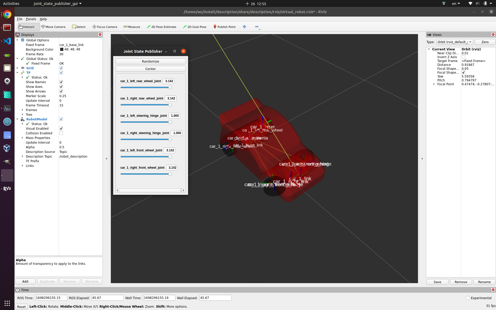

# Note

## Remember `source /opt/ros/humble/setup.bash` when starting every terminal

## Create a C++ ROS2 package

```bash
cd /home/ws/src/
ros2 pkg create --build-type ament_cmake <package_name>
```

## Build a C++ ROS2 package

```bash
cd /home/ws/
colcon build --symlink-install
```

## Display urdf in rviz2
```bash
source install/setup.bash
ros2 launch description display_rviz.launch.py
```
