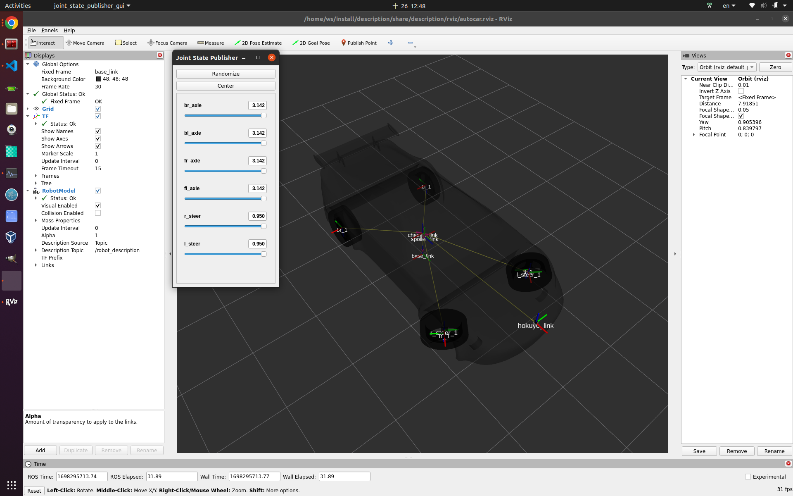

# Note

## Remember `source /opt/ros/humble/setup.bash` when starting every terminal

## Create a C++ ROS2 package

```bash
cd /home/ws/src/
ros2 pkg create --build-type ament_cmake <package_name>
```

## Build a C++ ROS2 package

```bash
cd /home/ws/
colcon build --symlink-install
```

## Preview URDF in rviz2 (Cannot work with Gazebo)
> Just for making sure the parts in the urdf that are unrelated to Gazebo and control are correct.
```bash
source install/setup.bash
ros2 launch description preview_urdf.launch.py
```

## Spawn URDF in Gazebo
```bash
source install/setup.bash
ros2 launch description publish_robot_state.launch.py # Publish /robot_description
ros2 launch gazebo_ros gazebo.launch.py # Lauch empty Gazebo
ros2 run gazebo_ros spawn_entity.py -topic robot_description -entity robot_name # Spawn robot in Gazebot
```